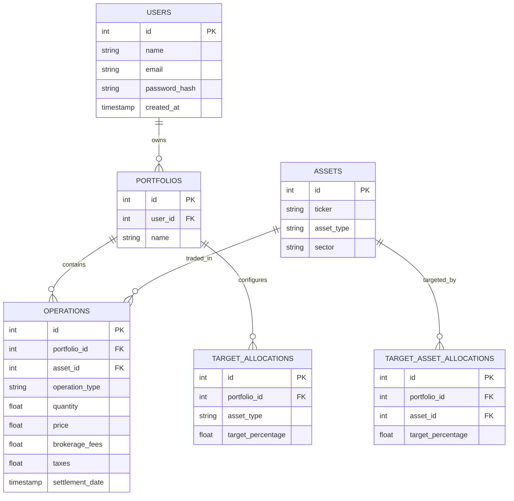

# CLEARfolio - Personal Investment Portfolio Management System

## Complete System Architecture
CLEARfolio is designed as a monolithic full-stack application for MVP, with clear boundaries between the frontend and backend, enabling easy future migration to a microservices architecture.

### Technology Stack
- **Frontend**: React 19, TypeScript, Vite, TailwindCSS, Shadcn UI, Recharts, React Router v7.
- **Backend**: Node.js, Express, TypeScript.
- **Database**: SQLite (via `better-sqlite3`) managed by Drizzle ORM.
- **AI Integration**: Google Gemini 3.5 Flash via `@google/genai` (Server-side).

### Folder Structure
```text
/
├── data/                  # SQLite database files
├── drizzle/               # Drizzle ORM migrations
├── components/ui/         # Shadcn UI primitives
├── src/
│   ├── components/        # Reusable React components (AiAssistant, etc.)
│   ├── db/                # Database schema (schema.ts) and Drizzle config
│   ├── lib/               # Utility functions and API wrappers
│   ├── pages/             # Route-level components (Dashboard, Portfolio, etc.)
│   ├── types.ts           # Shared TypeScript interfaces
│   ├── App.tsx            # Application entrypoint & Routing
│   └── main.tsx           # React bootstrap
├── server.ts              # Express Backend & Vite Middleware
├── package.json           # Dependencies and scripts
└── drizzle.config.ts      # Drizzle Configuration
```

## Database Schema & Entity Relationship Diagram (ERD)



## API Design (RESTful)

| Endpoint | Method | Description |
|---|---|---|
| `/api/health` | GET | Health check. |
| `/api/dashboard` | GET | Aggregates stats: total invested, portfolio value, P/L, Darf. |
| `/api/assets` | GET | Returns user holdings with current price, average price, target %. |
| `/api/operations` | GET | Returns operation history. |
| `/api/operations` | POST | Inserts a new operation (buy/sell/div). |
| `/api/gemini/analyze` | POST | Proxies requests to Gemini AI securely. |

## Development Roadmap & Scalability Plan

**Phase 1: MVP (Current)**
- Express + SQLite Monolith.
- Local mocked market data.
- Basic CRUD for operations and portfolio viewing.
- Basic AI portfolio analysis via Gemini.

**Phase 2: Broker Integration & Live Data**
- Integrate B3 / Yahoo Finance API for real-time `currentPrice`.
- Implement PDF Parsing (OCR/RegEx) in Node.js for CLEAR Corretora Broker Notes.
- Expand Tax Module to generate actual DARF PDFs.

**Phase 3: Cloud & Scale**
- Migrate from SQLite to PostgreSQL (Cloud SQL).
- Containerize application (Docker) and deploy to Google Cloud Run.
- Implement robust OAuth2 authentication.
- Background workers (BullMQ/Redis) for real-time asset price polling.

## Security Recommendations
1. **API Keys**: Never expose `GEMINI_API_KEY` or database credentials to the client. Keep them securely in the environment or Secret Manager.
2. **Database**: Use parameterized queries (handled automatically by Drizzle ORM) to prevent SQL Injection.
3. **Authentication**: Implement JWT with short expiration times and HTTP-only cookies for session management.
4. **Rate Limiting**: Apply express-rate-limit to `/api/gemini/analyze` to prevent abuse of the AI generation endpoint.
